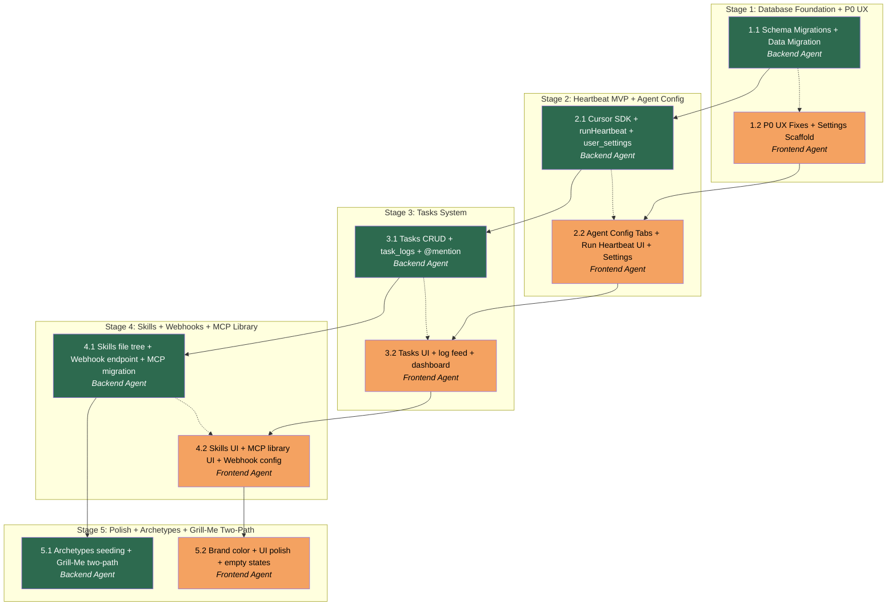

# APM Plan — Phase 2

## Workers

| Worker | Domain | Description |
|--------|--------|-------------|
| Backend Agent | Database, API, Server Actions | Drizzle schema + migrations, data migrations, Server Actions, `@cursor/sdk` heartbeat, encryption, skill file tree, webhook HMAC, tasks/task_logs logic, archetype seeding |
| Frontend Agent | UI, Components, E2E | React pages and components, business-selector dropdown, nav active state, agent config tabs, tasks UI, skills upload UI, MCP library UI, settings page, brand color, E2E tests |

## Stages

| Stage | Name | Tasks | Agents |
|-------|------|-------|--------|
| 1 | Database Foundation + P0 UX | 2 | Backend Agent, Frontend Agent |
| 2 | Heartbeat MVP + Agent Configuration | 2 | Backend Agent, Frontend Agent |
| 3 | Tasks System | 2 | Backend Agent, Frontend Agent |
| 4 | Skills + Webhooks + MCP Library | 2 | Backend Agent, Frontend Agent |
| 5 | Polish + Archetypes + Grill-Me Two-Path | 2 | Backend Agent, Frontend Agent |

## Dependency Graph

> **Dispatch note:** T1.1 and T1.2 can run in parallel — T1.2 only touches UI files and does not depend on completed migrations (it reads the existing schema which is compatible). For Stages 2–5, dispatch Backend first, then Frontend once backend deliverables are confirmed.

---

## Stage 1: Database Foundation + P0 UX Fixes

### Task 1.1: Schema Migrations + Data Migration — Backend Agent

- **Objective:** Apply all Phase 2 database schema changes via Drizzle migrations and safely migrate existing data (agent instructions → agent_documents, skills.markdown → skill_files, mcp_credentials.agent_id → business_id).
- **Branch:** `phase2/stage1-backend`
- **Output:**
  - Updated `db/schema.ts` with all new tables and column changes
  - Versioned migration files in `drizzle/`
  - Updated Drizzle relations
  - `.env.example` updated with any new var names
  - `db/README.md` updated
  - Vitest tests for any new utility logic (encryption helpers if added)
- **Validation:**
  - `npm run db:generate` exits 0 with SQL covering all new tables
  - `npm run db:migrate` applies cleanly on a fresh Neon branch
  - `npm run build` exits 0
  - `npm test` all existing tests green
  - `getDb()` can query all new tables without TypeScript errors
- **Schema changes to implement (see `docs/phase-2-architecture-spec.md` §2 for full SQL):**

  1. **`businesses`** — add nullable columns: `description text`, `github_repo_url text`, `local_path text`
  2. **`user_settings`** — new table: `id uuid PK`, `user_id text UNIQUE NOT NULL`, `cursor_api_key_encrypted jsonb`, `cursor_api_key_iv text`, `created_at timestamptz`, `updated_at timestamptz`
  3. **`agent_documents`** — new table: `id uuid PK`, `agent_id uuid FK→agents CASCADE`, `slug text NOT NULL`, `filename text NOT NULL`, `content text NOT NULL DEFAULT ''`, `created_at timestamptz`, `updated_at timestamptz`, `UNIQUE(agent_id, slug)`
  4. **`agent_archetypes`** — new table: `id uuid PK`, `slug text UNIQUE NOT NULL`, `name text NOT NULL`, `description text NOT NULL`, `soul_addendum text DEFAULT ''`, `tools_addendum text DEFAULT ''`, `heartbeat_addendum text DEFAULT ''`, `created_at timestamptz`
  5. **`agents`** — add column `archetype_id uuid REFERENCES agent_archetypes(id) ON DELETE SET NULL` — **do NOT drop `instructions` yet** (data migration runs first, see step 8)
  6. **`tasks`** — new table with `task_status` enum (`backlog`, `in_progress`, `blocked`, `in_review`, `done`): `id uuid PK`, `business_id uuid FK→businesses CASCADE`, `team_id uuid FK→teams SET NULL`, `agent_id uuid FK→agents SET NULL`, `parent_task_id uuid FK→tasks SET NULL`, `title text NOT NULL`, `description text NOT NULL DEFAULT ''`, `status task_status NOT NULL DEFAULT 'backlog'`, `blocked_reason text`, `approval_id uuid FK→approvals SET NULL`, `created_at timestamptz`, `updated_at timestamptz` + indexes on business_id, agent_id, team_id, parent_task_id, status
  7. **`task_logs`** — new table with `task_log_author_type` enum (`agent`, `human`): `id uuid PK`, `task_id uuid FK→tasks CASCADE`, `author_type task_log_author_type NOT NULL`, `author_id text NOT NULL`, `content text NOT NULL`, `created_at timestamptz` + index on task_id
  8. **Data migration — `agent_documents`**: For every existing agent that has a non-empty `instructions` column, insert a row in `agent_documents` with `slug='soul'`, `filename='soul.md'`, `content=agents.instructions`. Also insert empty rows for `slug='tools'` (filename `tools.md`) and `slug='heartbeat'` (filename `heartbeat.md`) for all agents. After data migration runs cleanly, drop `agents.instructions` column in a subsequent migration step.
  9. **`skill_files`** — new table: `id uuid PK`, `skill_id uuid FK→skills CASCADE`, `path text NOT NULL`, `content text NOT NULL`, `created_at timestamptz`, `UNIQUE(skill_id, path)` + index on skill_id
  10. **Data migration — `skill_files`**: For every existing skill with non-empty `markdown`, insert a `skill_files` row with `path='SKILL.md'`, `content=skills.markdown`. After data migration, drop `skills.markdown` column.
  11. **`mcp_credentials`** — migrate FK from `agent_id` to `business_id`: add column `business_id uuid REFERENCES businesses(id) ON DELETE CASCADE NOT NULL` (populate from agent→business join first), then drop `agent_id` column and unique index `mcp_credentials_agent_id_mcp_name_unique`, add new unique index on `(business_id, mcp_name)`.
  12. **`agent_mcp_access`** — new junction table: `id uuid PK`, `agent_id uuid FK→agents CASCADE`, `mcp_credential_id uuid FK→mcp_credentials CASCADE`, `created_at timestamptz`, `UNIQUE(agent_id, mcp_credential_id)`. Data migration: for each existing `mcp_credential`, insert an `agent_mcp_access` row linking it to its original agent (from before the FK migration).

- **Implementation steps:**
  1. Edit `db/schema.ts`: add all new tables and modify existing ones (add columns, define new enums). Use Drizzle `pgTable`, `pgEnum`. Maintain existing exports — do not remove any table that existing code imports.
  2. Update all `relations()` calls in `db/schema.ts` to cover new tables.
  3. Run `npm run db:generate` to produce migration SQL. Review the SQL output for correctness.
  4. If the auto-generated migration does not include data migrations (it won't — Drizzle only generates DDL), create a separate migration file manually in `drizzle/` for the data migrations (instructions→agent_documents, skills.markdown→skill_files, mcp_credentials agent_id→business_id population). Label it clearly.
  5. After data migrations: create another Drizzle migration to DROP the deprecated columns (`agents.instructions`, `skills.markdown`, `mcp_credentials.agent_id`). Update `db/schema.ts` to remove those columns.
  6. Run `npm run db:migrate` and verify all migrations apply in order.
  7. Update `db/README.md` with the new table list, migration notes, and Phase 2 changes.
  8. Run `npm run build` and `npm test`. Fix any TypeScript errors caused by removed columns (update any remaining references to `agents.instructions` in Server Actions — replace with `agent_documents` query; update `skills.markdown` references).
  9. Search for any code that references `mcp_credentials.agentId` FK and update to use `businessId` + `agent_mcp_access` pattern.

- **Dependencies:** None (builds on Phase 1 schema already in `main`).

---

### Task 1.2: P0 UX Fixes + Settings Page Scaffold — Frontend Agent

- **Objective:** Fix all P0 UX blockers from the UI/UX review, add shared `<Button>` component, scaffold the Settings page, and fix the dashboard business link destination.
- **Branch:** `phase2/stage1-frontend`
- **Output:**
  - Business-selector replaced with `<select>` dropdown on agents, teams, approvals pages
  - Nav active state via `usePathname()`
  - Dashboard business links fixed (→ agents, not Grill-Me)
  - `components/ui/button.tsx` via shadcn + all inline button styles refactored to use it
  - `app/dashboard/settings/page.tsx` scaffold (form fields for Cursor API key + local path, wired to Server Actions stubs)
  - Brand accent color added to `app/globals.css`
  - Playwright E2E: smoke test updated to verify nav active state and business-selector renders as `<select>`
- **Validation:**
  - `npm run build` exits 0
  - `npm test` (Vitest) all green
  - `npx playwright test tests/smoke.spec.ts` passes
  - Business selector renders as a `<select>` element on `/dashboard/agents`, `/dashboard/teams`, `/dashboard/approvals`
  - Clicking a nav link adds an active class visible in DOM
  - Clicking a business on dashboard navigates to `/dashboard/agents?businessId=...`
  - Settings page at `/dashboard/settings` renders without errors

- **P0 fixes to implement (see `docs/phase-2-ui-ux-review.md` §Critical Fejl):**

  1. **Business-selector → `<select>` dropdown** (berørte filer: `app/dashboard/agents/page.tsx`, `app/dashboard/teams/page.tsx`, `app/dashboard/approvals/page.tsx`):
     - Replace the `<nav>` with inline `<Link>` elements with a single `<select>` or shadcn `Select` component.
     - On change, call `router.push()` with the new `businessId` query param.
     - Show current business as the selected option (read from `searchParams.businessId`).
     - The select component must be a Client Component — extract to `components/business-selector.tsx` with `"use client"` directive.

  2. **Nav active state** (`app/components/nav-shell.tsx`):
     - Extract nav links into a `NavLinks` Client Component.
     - Use `usePathname()` from `next/navigation` to detect current route.
     - Apply active styling to matching link: add `font-medium text-foreground border-b border-foreground` (or equivalent) when pathname starts with the link's href.

  3. **Dashboard business link fix** (`app/dashboard/page.tsx`):
     - Change `<Link href={/dashboard/grill-me/${b.id}}>` to `<Link href={/dashboard/agents?businessId=${b.id}}>`.
     - Improve business card to show at minimum: name, `created_at` date.

  4. **shadcn `<Button>` component**:
     - Run `npx shadcn@latest add button` to install `components/ui/button.tsx`.
     - Refactor all duplicate inline button class strings to use `<Button>` instead. Target files: `app/dashboard/page.tsx`, `app/dashboard/agents/page.tsx`, `app/dashboard/teams/new/page.tsx`, `app/dashboard/agents/new/page.tsx`, `app/dashboard/onboarding/page.tsx`.

  5. **Brand accent color** (`app/globals.css`):
     - Add a dæmpet blue-violet accent to the CSS custom properties.
     - Set `--accent: oklch(0.55 0.18 260)` and `--accent-foreground: oklch(0.98 0 0)` in both `:root` and `.dark` blocks.
     - Use the accent on primary interactive elements (CTAs, active nav, Run Heartbeat button placeholder).

  6. **Settings page scaffold** (`app/dashboard/settings/page.tsx`):
     - Create the page as a Server Component.
     - Show two sections: "Account" (Cursor API Key input) and "Business" (Local Path input, GitHub Repo URL input).
     - Wire the form to Server Actions stubs: `saveUserSettings(cursorApiKey)` and `saveBusinessSettings(businessId, localPath, githubRepoUrl)`. These stubs can return `{ success: true }` for now — the full implementation is in Task 2.1 (Backend).
     - Add "Settings" link to nav-shell.

- **Implementation steps:**
  1. Run `npx shadcn@latest add button select` to install both UI primitives.
  2. Create `components/business-selector.tsx` (`"use client"`): accepts `businesses: {id, name}[]` and `currentBusinessId: string | null`; renders a `<select>` (or shadcn `Select`); calls `router.push()` on change.
  3. Update `app/dashboard/agents/page.tsx`, `app/dashboard/teams/page.tsx`, `app/dashboard/approvals/page.tsx`: replace inline `<nav>` business links with `<BusinessSelector>` client component.
  4. Extract nav links from `app/components/nav-shell.tsx` into `app/components/nav-links.tsx` (`"use client"`). Use `usePathname()` for active detection. Import into `nav-shell.tsx`.
  5. Add "Settings" to nav links pointing to `/dashboard/settings`.
  6. Fix `app/dashboard/page.tsx` business link destination. Improve card layout.
  7. Refactor all duplicate button class strings to use shadcn `<Button>`.
  8. Add accent color to `app/globals.css`.
  9. Create `app/dashboard/settings/page.tsx` with the two-section form. Create stub Server Actions in `lib/settings/actions.ts` (`"use server"`).
  10. Update Playwright smoke test to assert `<select>` exists and nav active class is present.

- **Dependencies:** Task 1.1 schema migration should be run before testing, but the Frontend changes do not have source-code dependencies on T1.1 output. Can be developed and committed independently.

---

## Stage 2: Heartbeat MVP + Agent Configuration

### Task 2.1: Cursor SDK + runHeartbeat + user_settings — Backend Agent

- **Objective:** Install `@cursor/sdk`, implement user settings encryption, build the `runHeartbeat(agentId)` Server Action with full prompt assembly and token logging.
- **Branch:** `phase2/stage2-backend`
- **Output:**
  - `@cursor/sdk` installed
  - `lib/settings/actions.ts` — full `saveUserSettings` with AES-256-GCM encryption (same pattern as `lib/mcp/actions.ts`)
  - `lib/heartbeat/prompt-builder.ts` — assembles heartbeat prompt from agent_documents + archetype addendum + runtime context
  - `lib/heartbeat/actions.ts` — `runHeartbeat(agentId)` Server Action
  - Token logging in `orchestration_events`
  - Vitest tests for prompt builder
  - READMEs

- **Validation:**
  - Vitest: `buildHeartbeatPrompt(agentId)` returns a string containing expected sections with mocked data
  - Vitest: `saveUserSettings` encrypts/decrypts correctly (round-trip with `ENCRYPTION_KEY`)
  - `runHeartbeat(agentId)` logs an `orchestration_events` row with `type: 'heartbeat_run'` and token fields in payload
  - `npm run build` exits 0; `npm test` all green

- **Implementation:**
  1. Run `npm install @cursor/sdk`. Add `CURSOR_API_KEY` note to `.env.example` (used via `user_settings` at runtime, not as a static env var).
  2. Complete `lib/settings/actions.ts` (`"use server"`):
     - `saveUserSettings(cursorApiKey: string)`: encrypt key using `encryptCredential()` from `lib/mcp/actions.ts` (or extract shared encryption util to `lib/crypto/aes.ts`), upsert into `user_settings`.
     - `getUserCursorApiKey()`: server-only — returns decrypted API key for the current auth user, or `null` if not set.
     - `saveBusinessSettings(businessId, { localPath, githubRepoUrl, description })`: updates `businesses` row.
  3. Create `lib/heartbeat/prompt-builder.ts`:
     - `buildHeartbeatPrompt(agentId: string): Promise<string>` — assembles prompt in sections:
       1. Soul: `agent_documents` where `slug='soul'` content
       2. Heartbeat template: `agent_documents` where `slug='heartbeat'` content
       3. Archetype addendum: if agent has `archetype_id`, append `agent_archetypes.heartbeat_addendum`
       4. Business context: `memory` rows for `businessId` (top 3 by `updated_at`)
       5. Open tasks: `tasks` where `agent_id=agentId AND status IN ('in_progress','backlog')` — title + description
       6. Recent task logs: last 5 `task_logs` entries across agent's tasks
       7. Pending approvals: `approvals` where `agent_id=agentId AND status='pending'`
     - Returns concatenated markdown string with `--- CONTEXT ---` separator sections.
  4. Create `lib/heartbeat/actions.ts` (`"use server"`):
     - `runHeartbeat(agentId: string)`: 
       1. Get business `local_path` from `businesses`
       2. Get user Cursor API key via `getUserCursorApiKey()`
       3. Build prompt via `buildHeartbeatPrompt(agentId)`
       4. Call `Agent.create({ apiKey, model: { id: 'composer-2' }, local: { cwd: localPath } })`
       5. Run `agent.send(prompt)`, collect response via `run.stream()`
       6. Log `orchestration_events` row: `type: 'heartbeat_run'`, payload `{ agentId, trigger: 'manual', tokensIn, tokensOut, model: 'composer-2', durationMs }`
       7. Return `{ success: true, eventId }`
  5. Write Vitest tests: `lib/heartbeat/__tests__/prompt-builder.test.ts` (mock DB, verify sections present).
  6. Write `lib/heartbeat/README.md`.

- **Dependencies:** Task 1.1.

---

### Task 2.2: Agent Config Tabs + Run Heartbeat UI + Settings Page — Frontend Agent

- **Objective:** Replace the instructions textarea on agent edit with a three-tab document editor (Soul / Tools / Heartbeat), add a "Run Heartbeat" button, and complete the Settings page with functional Cursor API key input.
- **Branch:** `phase2/stage2-frontend`
- **Output:**
  - `app/dashboard/agents/[agentId]/edit/page.tsx` — redesigned with 3-tab doc editor
  - `components/agents/document-editor.tsx` — tab component for soul/tools/heartbeat
  - `app/dashboard/settings/page.tsx` — complete with working API key save + feedback toast
  - "Run Heartbeat" button on agent detail/edit page
  - Playwright E2E update

- **Validation:**
  - Agent edit page renders 3 tabs; each tab shows a `<textarea>` or markdown editor with the correct document content
  - Saving a tab persists the content (calls `updateAgentDocument` Server Action)
  - "Run Heartbeat" button triggers `runHeartbeat(agentId)` and shows loading + success/error feedback
  - Settings page: enter a test API key → save → success toast → page reload shows "API key saved" indicator

- **Implementation:**
  1. Create `lib/agents/document-actions.ts` (`"use server"`): `getAgentDocuments(agentId)` returns all 3 docs; `updateAgentDocument(agentId, slug, content)` upserts the doc.
  2. Update `app/dashboard/agents/[agentId]/edit/page.tsx`:
     - Fetch agent documents (soul/tools/heartbeat) server-side.
     - Render `<DocumentEditor>` client component with the docs.
     - Remove the old `instructions` textarea.
  3. Create `components/agents/document-editor.tsx` (`"use client"`):
     - Three-tab UI (Soul / Tools / Heartbeat) using shadcn `Tabs`.
     - Each tab: `<textarea>` (or light markdown editor) + "Save" button.
     - On save, calls `updateAgentDocument` Server Action and shows inline feedback.
  4. Add "Run Heartbeat" button to agent page:
     - `components/agents/run-heartbeat-button.tsx` (`"use client"`): calls `runHeartbeat(agentId)` on click, shows loading spinner, then success/error state.
     - Wire to `lib/heartbeat/actions.ts:runHeartbeat`.
  5. Complete `app/dashboard/settings/page.tsx`:
     - Fetch existing user settings server-side (show masked API key if set).
     - Form for Cursor API Key: on submit calls `saveUserSettings`.
     - Form for Business Settings: local path + GitHub repo URL (calls `saveBusinessSettings`).
     - Show toast on success/error (install `sonner` if not present: `npx shadcn@latest add sonner`).
  6. Update Playwright E2E in `tests/agents.spec.ts` or add new spec for agent doc editor.

- **Dependencies:** Task 1.2, **Task 2.1 by Backend Agent** (Server Actions: `runHeartbeat`, `saveUserSettings`, `saveBusinessSettings`, `getAgentDocuments`, `updateAgentDocument`).

---

## Stage 3: Tasks System

### Task 3.1: Tasks CRUD + task_logs + @mention trigger — Backend Agent

- **Objective:** Implement the full tasks data layer: CRUD Server Actions, task log append, `@mention` detection that writes a soft heartbeat trigger, and tasks-to-approvals link.
- **Branch:** `phase2/stage3-backend`
- **Output:**
  - `lib/tasks/actions.ts` — createTask, updateTask, updateTaskStatus, deleteTask, getTasksByBusiness, getTasksByAgent
  - `lib/tasks/log-actions.ts` — appendTaskLog, getTaskLogs
  - `lib/tasks/mention-trigger.ts` — parseAndTriggerMentions (writes `orchestration_events` row)
  - Vitest tests
  - READMEs

- **Validation:**
  - Vitest: `createTask` inserts with correct defaults; `updateTaskStatus` to `in_review` with `approval_id` links correctly
  - `parseAndTriggerMentions("@alice review this")` with agent name "alice" writes an `orchestration_events` row with `type: 'mention_trigger'`
  - Parent/child task hierarchy works: `getTasksByBusiness` returns nested structure
  - `npm run build` exits 0; `npm test` all green

- **Implementation:**
  1. Create `lib/tasks/actions.ts` (`"use server"`):
     - `createTask(businessId, { title, description, teamId?, agentId?, parentTaskId? })` — inserts with `status: 'backlog'`
     - `updateTask(taskId, { title?, description?, agentId?, teamId? })` — partial update
     - `updateTaskStatus(taskId, status, { blockedReason?, approvalId? })` — updates status; if `status='in_review'` and `approvalId` provided, links approval
     - `deleteTask(taskId)` — cascades children
     - `getTasksByBusiness(businessId)` — returns flat list with hierarchy metadata
     - `getTasksByAgent(agentId)` — tasks assigned to agent across all businesses
  2. Create `lib/tasks/log-actions.ts` (`"use server"`):
     - `appendTaskLog(taskId, content, authorType: 'agent'|'human', authorId)` — inserts into `task_logs`
     - `getTaskLogs(taskId)` — returns ordered log entries
  3. Create `lib/tasks/mention-trigger.ts`:
     - `parseAndTriggerMentions(taskId, logContent, businessId)`: scans `logContent` for `@<agentName>` patterns, queries agents by name, for each match inserts `orchestration_events` row with `type: 'mention_trigger'`, `payload: { agentId, taskId, trigger: 'mention', excerpt: ... }`
  4. Wire `appendTaskLog` to call `parseAndTriggerMentions` after insert (only for `authorType='human'`).
  5. Write Vitest tests in `lib/tasks/__tests__/`.
  6. Write `lib/tasks/README.md`.

- **Dependencies:** Task 2.1.

---

### Task 3.2: Tasks UI + log feed + dashboard integration — Frontend Agent

- **Objective:** Build the tasks management UI: task list per business, task detail with log feed, new task form, status column board, and tasks summary on the dashboard.
- **Branch:** `phase2/stage3-frontend`
- **Output:**
  - `app/dashboard/tasks/page.tsx` — task list with status columns
  - `app/dashboard/tasks/new/page.tsx` — create task form
  - `app/dashboard/tasks/[taskId]/page.tsx` — task detail + log feed + comment input
  - `components/tasks/task-card.tsx`, `task-log-feed.tsx`, `task-comment-input.tsx`
  - Dashboard updated to show task summary (pending/in-progress counts)
  - Tasks link in nav

- **Validation:**
  - Create a task → it appears in the task list under "Backlog"
  - Open task detail → log feed shows entries in chronological order
  - Submit comment with `@agentName` → comment appears in feed; `orchestration_events` row is written
  - Dashboard shows "X tasks in progress" count

- **Implementation:**
  1. Add "Tasks" to nav-shell links.
  2. Create `app/dashboard/tasks/page.tsx`: fetches tasks by business (from `searchParams.businessId`), groups by status, renders status columns (Backlog / In Progress / Blocked / In Review / Done). Each task as a card with title, assigned agent, link to detail.
  3. Create `app/dashboard/tasks/new/page.tsx`: form with title, description (textarea), agent selector (dropdown from business agents), team selector, parent task selector.
  4. Create `components/tasks/task-log-feed.tsx`: chronological list of log entries. Agent entries show agent name + content (markdown rendered). Human entries show "You" + content.
  5. Create `components/tasks/task-comment-input.tsx` (`"use client"`): textarea with submit, calls `appendTaskLog` Server Action.
  6. Create `app/dashboard/tasks/[taskId]/page.tsx`: shows task title, status, description, assigned agent/team. Below: `<TaskLogFeed>` + `<TaskCommentInput>`.
  7. Update `app/dashboard/page.tsx` business cards to show task counts (in_progress count, blocked count).
  8. Write/update Playwright E2E.

- **Dependencies:** Task 2.2, **Task 3.1 by Backend Agent** (Server Actions: all tasks + log actions).

---

## Stage 4: Skills + Webhooks + MCP Library

### Task 4.1: Skills file tree + Webhook endpoint + MCP credential migration — Backend Agent

- **Objective:** Implement multi-file skill system (upload + GitHub-link), the incoming webhook HMAC endpoint, and update MCP credential queries to use the new `business_id` + `agent_mcp_access` model.
- **Branch:** `phase2/stage4-backend`
- **Output:**
  - `lib/skills/file-actions.ts` — upload and GitHub-link skill install
  - `app/api/webhooks/[businessId]/receive/route.ts` — HMAC webhook endpoint
  - Updated `lib/mcp/actions.ts` — queries updated for `business_id` model
  - Vitest tests

- **Validation:**
  - Upload a zip with `SKILL.md` + `reference/adapt.md` → both rows appear in `skill_files`
  - GitHub-link install: mocked GitHub API returns two files → both rows in `skill_files`
  - Webhook POST with correct HMAC signature returns 202; incorrect signature returns 401
  - Webhook with duplicate `X-Idempotency-Key` returns 202 without re-processing
  - `getMcpCredentialsByBusiness(businessId)` returns credentials correctly
  - `npm run build` exits 0; `npm test` all green

- **Implementation:**
  1. Create `lib/skills/file-actions.ts` (`"use server"`):
     - `installSkillFromFiles(businessId, skillName, files: { path: string, content: string }[])`: upserts `skills` row, then upserts each file into `skill_files`.
     - `installSkillFromGitHub(businessId, skillName, githubUrl: string)`: parses the GitHub URL to extract owner/repo/ref/path, calls `https://api.github.com/repos/{owner}/{repo}/contents/{path}?ref={ref}` recursively (only `.md` and `.mjs`/`.js` files, max depth 2), inserts into `skill_files`.
     - `deleteSkillFiles(skillId)` — cascades via FK.
  2. Create `app/api/webhooks/[businessId]/receive/route.ts`:
     - Reads `X-Idempotency-Key` from headers (required — return 400 if missing).
     - Reads `X-Webhook-Signature` header.
     - Verifies HMAC using `lib/webhooks/hmac.ts:verifySignature` with business webhook secret (for MVP: use `WEBHOOK_SECRET` env var; note: per-business secrets are Phase 3).
     - Checks `webhook_deliveries` for existing `idempotency_key`; if found, return 202.
     - Inserts `webhook_deliveries` row.
     - Parses `event_type` from body; writes `orchestration_events` row with `type: 'webhook_trigger'`.
     - Returns 202 Accepted immediately.
  3. Update `lib/mcp/actions.ts` to use the new schema:
     - `getMcpCredentialsByBusiness(businessId)`: queries `mcp_credentials WHERE business_id=businessId`.
     - `getMcpCredentialsForAgent(agentId)`: joins `agent_mcp_access` → `mcp_credentials`.
     - `grantMcpAccessToAgent(agentId, mcpCredentialId)`: inserts into `agent_mcp_access`.
     - `revokeMcpAccessFromAgent(agentId, mcpCredentialId)`: deletes from `agent_mcp_access`.
     - `saveMcpCredential(businessId, mcpName, payload)`: uses `business_id` not `agent_id`.
  4. Write Vitest tests: `lib/skills/__tests__/file-actions.test.ts`, webhook route test.
  5. Write READMEs: update `lib/skills/README.md`, `lib/webhooks/README.md`, `lib/mcp/README.md`.

- **Dependencies:** Task 3.1.

---

### Task 4.2: Skills UI + MCP Library UI + Webhook config — Frontend Agent

- **Objective:** Build the skills management UI (upload and GitHub-link install flows), the business-level MCP credential library with agent opt-in, and a simple webhook configuration display.
- **Branch:** `phase2/stage4-frontend`
- **Output:**
  - `app/dashboard/skills/page.tsx` — skills list + install options
  - `components/skills/upload-form.tsx` — file upload flow
  - `components/skills/github-link-form.tsx` — GitHub URL install flow
  - `app/dashboard/settings/page.tsx` — updated with MCP library section
  - `components/mcp/mcp-library.tsx` — business-level credential management with agent opt-in
  - Webhook config display in settings or a dedicated page

- **Validation:**
  - Upload a zip file → skill appears in list with file count
  - Enter GitHub URL → skill installs with files listed
  - MCP library: add a credential at business level → it appears; toggle agent access for an agent → `agent_mcp_access` row created

- **Implementation:**
  1. Create `app/dashboard/skills/page.tsx`: lists skills for selected business. Each skill shows name, file count, assigned agents. Upload button + GitHub link button open respective forms.
  2. Create `components/skills/upload-form.tsx` (`"use client"`): file input accepting zip or multiple files. On submit, reads files client-side, passes to `installSkillFromFiles` Server Action.
  3. Create `components/skills/github-link-form.tsx` (`"use client"`): text input for GitHub URL. On submit, calls `installSkillFromGitHub` Server Action. Shows loading + result.
  4. Update `app/dashboard/settings/page.tsx` to include MCP Library section:
     - Renders `<McpLibrary businessId={...}>` component.
  5. Create `components/mcp/mcp-library.tsx` (`"use client"`):
     - Lists all MCP credentials for the business.
     - For each credential: shows mcp_name, agents with access (from `agent_mcp_access`), toggle per agent.
     - "Add credential" button: opens form to install new MCP credential at business level.
  6. Add webhook info section to settings: shows endpoint URL pattern (`/api/webhooks/[businessId]/receive`) and recent webhook deliveries count.

- **Dependencies:** Task 3.2, **Task 4.1 by Backend Agent** (file-actions, updated mcp-actions).

---

## Stage 5: Polish + Archetypes + Grill-Me Two-Path

### Task 5.1: Archetypes seeding + Grill-Me two-path onboarding — Backend Agent

- **Objective:** Seed the two launch archetypes, update Grill-Me to support two onboarding paths (existing business vs. new project), and update the heartbeat prompt builder to inject archetype addenda.
- **Branch:** `phase2/stage5-backend`
- **Output:**
  - `db/seeds/archetypes.ts` — seeds `vertical-fullstack` and `harness-engineer`
  - `lib/grill-me/actions.ts` — updated with path selection and new system prompt
  - `lib/heartbeat/prompt-builder.ts` — updated to inject archetype addenda
  - Vitest tests

- **Validation:**
  - Seed script inserts 2 archetypes; re-running is idempotent (upsert on slug)
  - Grill-Me path A (existing) system prompt differs from path B (new project) system prompt
  - `buildHeartbeatPrompt` for agent with archetype includes `heartbeat_addendum` content

- **Implementation:**
  1. Create `db/seeds/archetypes.ts`: upserts the two archetypes with full `soul_addendum`, `tools_addendum`, `heartbeat_addendum` content from spec. Run via `npm run db:seed` script.
  2. Add `npm run db:seed` to `package.json`: `tsx db/seeds/archetypes.ts`.
  3. Update `lib/grill-me/actions.ts`:
     - Add `businessType: 'existing' | 'new'` param to `startGrillMeTurn`.
     - Path A system prompt focuses on: current stack, workflows, bottlenecks, what to automate.
     - Path B system prompt focuses on: what to build, target audience, tech choices, MVP scope.
     - Output format for both paths: the 6-section soul markdown (`# What We Build`, `# Our Current Goals`, `# Working Method & Values`, `# Technical Context`, `# What We DON'T Do`, `# Open Questions`).
  4. Update `lib/heartbeat/prompt-builder.ts`: if agent has `archetype_id`, fetch archetype and append `heartbeat_addendum` after the heartbeat template section.
  5. Write Vitest tests.

- **Dependencies:** Task 4.1.

---

### Task 5.2: Brand color + UI polish + empty states + business dashboard — Frontend Agent

- **Objective:** Apply remaining P1/P2 UX improvements: better empty states with context, business dashboard cards with metadata, save feedback on all forms, and polish the overall visual quality.
- **Branch:** `phase2/stage5-frontend`
- **Output:**
  - Improved empty states on Agents, Teams, Approvals, Tasks pages
  - Business dashboard cards with agent count + task counts + "last active"
  - Toast/save feedback on all forms that currently lack it
  - Grill-Me onboarding: two-path selection (existing vs. new business)
  - Dark mode cleanup (remove `dark:bg-green-950` dead code or implement properly)
  - "New business" CTA button in nav instead of nav link

- **Validation:**
  - Empty state on Agents page explains what agents do and has a "Create Agent" CTA
  - Business card on dashboard shows agent count and pending task count
  - Edit Agent → save → success toast visible
  - Grill-Me onboarding shows two-path selection before starting the chat

- **Implementation:**
  1. Update empty states: Agents, Teams, Approvals, Tasks — each should have a 2-3 sentence explanation of purpose and a primary CTA.
  2. Update `app/dashboard/page.tsx` business cards: fetch agent count + task `in_progress` count for each business. Show as `X agents · Y tasks in progress`.
  3. Add `<Toaster>` from sonner to root layout if not already there. Wire success toasts to all forms: agent edit, team create, settings save.
  4. Update `app/dashboard/onboarding/page.tsx` (or `app/dashboard/grill-me/new/page.tsx`): add a step before name input that asks "Is this an existing business or a new project?" — two cards or radio buttons. Pass selection forward to Grill-Me chat.
  5. Clean up dark mode: remove `dark:bg-green-950` from `agent-status-badge.tsx`. Either implement `next-themes` properly (add `ThemeProvider`, toggle in settings) or strip all `dark:` utilities. Choose based on scope — minimum: strip dead dark utilities.
  6. Reposition "New business" from nav link to a `<Button variant="outline">` icon-button (`+`) in the nav.

- **Dependencies:** Task 4.2, **Task 5.1 by Backend Agent** (two-path Grill-Me params, archetype data).
