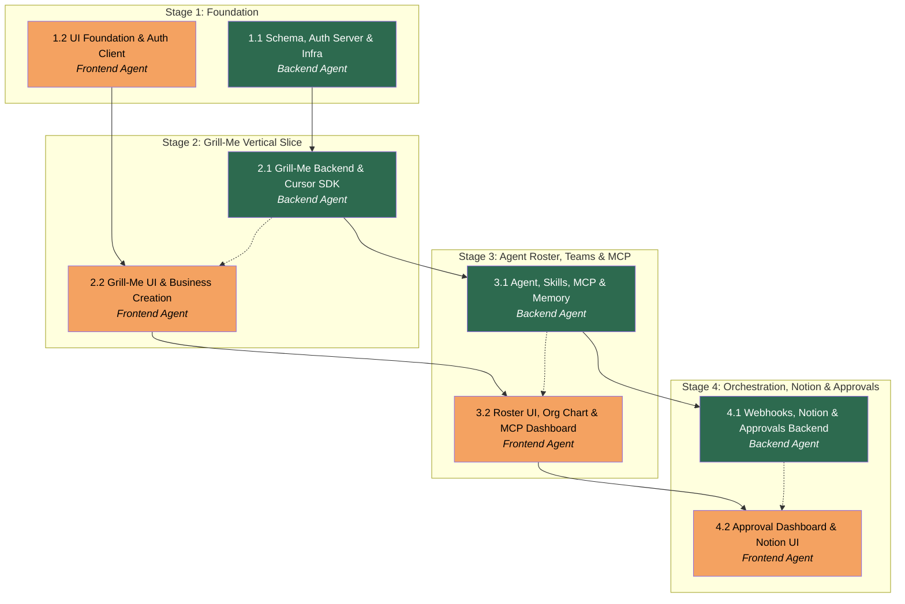

---

## title: AI Business Platform

modified: Plan creation by the Planner.

# APM Plan

> **Phase 2 (aktiv implementering):** Sekventering, gren-navne og valideringskriterier finder du i **`.apm/tracker.md`** samt **`docs/phase-2-architecture-spec.md`** (teknik/architecture roadmap) og **`docs/phase-2-ui-ux-review.md`**. Tabellen **Stages** nedenfor beskriver den **oprindelige Phase 1**-Planner; brug ikke den som sandhed for Phase 2 task-rækkefølge.

## Workers

| Worker         | Domain                      | Description                                                                                                                                                                                                    |
| -------------- | --------------------------- | -------------------------------------------------------------------------------------------------------------------------------------------------------------------------------------------------------------- |
| Backend Agent  | Database, API, Integrations | Drizzle schema + migrations, Neon Auth server, all Server Actions and API Routes, Cursor SDK integration, Notion API client, webhook engine, memory retrieval, MCP credential encryption, Docker/infra, Vitest |
| Frontend Agent | UI, Components, E2E         | Tailwind v4 + shadcn/ui setup, all React components and pages, auth client integration, markdown editor, org chart visualization, SSE client hooks, Playwright E2E tests                                       |

## Stages

| Stage | Name                              | Tasks | Agents                        |
| ----- | --------------------------------- | ----- | ----------------------------- |
| 1     | Foundation                        | 2     | Backend Agent, Frontend Agent |
| 2     | Grill-Me Vertical Slice           | 2     | Backend Agent, Frontend Agent |
| 3     | Agent Roster, Teams & MCP         | 2     | Backend Agent, Frontend Agent |
| 4     | Orchestration, Notion & Approvals | 2     | Backend Agent, Frontend Agent |

## Dependency Graph

---

> **Notes:**
>
> - Backend Agent leads each stage; Frontend Agent follows via cross-agent dependency on Server Action contracts. The Manager should dispatch T1.1 and T1.2 in parallel (Stage 1 is the only fully parallel stage). In Stage 2–4, dispatch Backend first, then Frontend once the cross-agent deliverable is confirmed.
> - The critical path is the Backend Agent chain: T1.1 → T2.1 → T3.1 → T4.1. Delays here cascade to all Frontend tasks.
> - Stage 2 is the acceptance milestone for MercFlow as a business instance — the Manager should seed a MercFlow `businesses` row and run the full Grill-Me flow on it as the Stage 2 holistic check.
> - Stage 3 convergence (T3.2 depending on both T2.2 and T3.1) is a coordination point: the Manager should confirm both are delivered before dispatching T3.2.
> - MCP credential encryption (`ENCRYPTION_KEY`) must be in `.env.local` before any T3.1 work that touches credentials. The Manager should prompt the user to set this value before T3.1 starts.

## Stage 1: Foundation

### Task 1.1: Schema, Auth Server & Infra - Backend Agent

- **Objective:** Establish the complete database schema, Neon Auth server integration, and project infrastructure so all subsequent backend work has a solid, migration-tracked foundation.
- **Output:** Complete `db/schema.ts` with all tables and relations; versioned migration files in `drizzle/`; Neon Auth server files (`lib/auth/server.ts`, `app/api/auth/[...path]/route.ts`, `middleware.ts`); updated `.env.example`; `Dockerfile`; `vitest.config.ts`; README in `db/`.
- **Validation:** `npm run db:generate` produces SQL with all tables; `npm run db:migrate` applies cleanly to a fresh Neon database; `npm run build` exits 0; `npm test` runs with 0 failures (no tests yet is acceptable); `curl /api/auth/session` returns 401 for unauthenticated request; `docker build` exits 0.
- **Guidance:** Follow the Spec §Database Schema Decisions for the full table list. Use `drizzle-orm/pg-core` types: `uuid`, `text`, `timestamp` (with `withTimezone: true`), `integer`, `jsonb`, `bytea`. All PKs use `.primaryKey().defaultRandom()`. All timestamps use `.notNull().defaultNow()` with UTC. For `agents.reports_to_agent_id`, use a self-referential FK with `.references(() => agents.id)`. For `mcp_credentials.encrypted_payload` use `jsonb`, for `iv` use `text` (base64-encoded). Neon Auth setup follows Spec §Authentication Architecture — use `createNeonAuth()` from `@neondatabase/auth/next/server`. Middleware protects all routes under `/dashboard/:path`* and `/api/protected/:path`*; public routes are `/`, `/auth/:path`*. Dockerfile is multi-stage: `node:20-alpine` builder + runner, copies only production files, exposes port 3000. Vitest config uses `@vitejs/plugin-react` and covers `lib/**/*.ts`. Add all new env var names (without values) to `.env.example` with inline comments.
- **Dependencies:** None.

1. Install new dependencies: `npm install @neondatabase/auth drizzle-orm @neondatabase/serverless` (update existing), `npm install -D vitest @vitejs/plugin-react @vitest/ui`.
2. Expand `db/schema.ts` to define all tables from Spec §Database Schema Decisions using Drizzle `pgTable`. Define tables in dependency order (no forward references): `businesses` (already exists — extend or leave), `user_businesses`, `memory`, `grill_me_sessions`, `agents`, `skills`, `agent_skills`, `teams`, `team_members`, `mcp_credentials`, `orchestration`, `webhook_deliveries`, `approvals`. Export a unified `schema` object.
3. Define Drizzle relations (`relations()`) for all FK relationships so `db/index.ts` can provide typed relational queries.
4. Run `npm run db:generate` and verify the SQL output covers all tables. Commit the generated migration file.
5. Create `lib/auth/server.ts` with `createNeonAuth()` instance. Create `app/api/auth/[...path]/route.ts` exporting `auth.handler()`. Create `middleware.ts` with `auth.middleware()` protecting dashboard and protected API routes.
6. Create `lib/auth/client.ts` stub (client-side auth instance — minimal, Frontend Agent will expand in T1.2). Mark with `"use client"` and export `authClient` from `createAuthClient()`.
7. Add `NEON_AUTH_BASE_URL` and `NEON_AUTH_COOKIE_SECRET` to `.env.example` with descriptive comments. Add `ENCRYPTION_KEY` (32-byte AES key) and `NOTION_API_TOKEN` stubs.
8. Create `Dockerfile` with multi-stage build. Create `.dockerignore` excluding `node_modules`, `.next`, `.env`*.
9. Create `vitest.config.ts` at project root. Add `"test": "vitest"` and `"test:ui": "vitest --ui"` scripts to `package.json`.
10. Write `db/README.md` documenting the schema: table purposes, key relations, FK constraints, migration workflow (`db:generate` → `db:migrate`).

---

### Task 1.2: UI Foundation & Auth Client - Frontend Agent

- **Objective:** Establish the visual foundation (Tailwind v4 + shadcn preset), auth client integration with pre-built UI components, base application shell, and Playwright E2E infrastructure.
- **Output:** Tailwind v4 configured with shadcn preset `b3YQiewWyG`; `NeonAuthUIProvider` in root layout; `lib/auth/client.ts` (client auth instance); auth pages (`/auth/[path]`, `/account/[path]`); base navigation shell component; `playwright.config.ts`; baseline smoke test; README in `app/`.
- **Validation:** `npm run dev` loads at `/` with correct theme colors; `/auth/sign-in` renders the Neon Auth sign-in form; sign-up → sign-in → sign-out flow completes without error; `UserButton` renders for authenticated users; Playwright smoke test (`npx playwright test`) exits 0.
- **Guidance:** Install shadcn with `npx shadcn@latest init --preset b3YQiewWyG`. Install Tailwind v4: `npm install tailwindcss@next @tailwindcss/vite` (or `@tailwindcss/postcss` — check compatibility with Next.js 15). In global CSS use `@import "tailwindcss"; @import "@neondatabase/auth/ui/tailwind";` — never import both `ui/tailwind` and `ui/css`. Install `@neondatabase/auth` for the client-side package. Wrap `<html>` with `suppressHydrationWarning` in `app/layout.tsx` (Neon Auth provider injects theme class client-side). Auth pages follow Spec §Authentication Architecture (`AuthView`, `AccountView`, `generateStaticParams`, `dynamicParams = false`). Base navigation shell should be a Server Component showing `SignedIn`/`SignedOut` conditional rendering — keep it minimal (logo, nav links placeholder, `UserButton`). Playwright config targets `http://localhost:3000`; baseline smoke test checks `/` returns 200 and `/auth/sign-in` renders a form input.
- **Dependencies:** None.

1. Install Tailwind v4 and PostCSS/Vite plugin compatible with Next.js 15. Initialize shadcn: `npx shadcn@latest init --preset b3YQiewWyG`. Verify the preset applies correctly at `/`.
2. Install `@neondatabase/auth` (client package). Create `lib/auth/client.ts` with `"use client"` directive and `createAuthClient()` from `@neondatabase/auth/next`. Overwrite the stub left by Backend Agent.
3. Update `app/layout.tsx`: import `NeonAuthUIProvider` and `authClient`; wrap children; add `suppressHydrationWarning` to `<html>`; import `@neondatabase/auth/ui/tailwind` CSS (via global CSS file — not direct import in layout).
4. Create `app/auth/[path]/page.tsx` with `AuthView`. Create `app/account/[path]/page.tsx` with `AccountView` and `generateStaticParams`.
5. Create `app/components/nav-shell.tsx` (Server Component): logo placeholder, navigation link placeholders, `SignedIn`/`SignedOut` with `UserButton`. Import into root layout.
6. Create `app/dashboard/page.tsx` placeholder (protected route — middleware redirects unauthenticated users to `/auth/sign-in`).
7. Install Playwright: `npm install -D @playwright/test`. Run `npx playwright install`. Create `playwright.config.ts` with `baseURL: 'http://localhost:3000'`, `webServer` pointing to `npm run dev`.
8. Write `tests/smoke.spec.ts`: test that `/` returns 200 and `/auth/sign-in` has a form with an email input.
9. Add `"test:e2e": "playwright test"` script to `package.json`.
10. Write `app/README.md` documenting the route structure, component conventions (Server vs Client), and how auth context flows through the layout.

---

## Stage 2: Grill-Me Vertical Slice

### Task 2.1: Grill-Me Backend & Cursor SDK - Backend Agent

- **Objective:** Implement the Grill-Me conversation backend: business creation, Cursor SDK integration for turn-based agent conversation, SSE streaming endpoint, and soul file extraction with memory persistence.
- **Output:** `lib/cursor/agent.ts` (SDK wrapper); `lib/grill-me/actions.ts` (Server Actions); `app/api/grill-me/stream/route.ts` (SSE endpoint); updated `db/schema.ts` if `grill_me_sessions` needs adjustment; Vitest tests; README in `lib/cursor/` and `lib/grill-me/`.
- **Validation:** Vitest: mocked `@cursor/sdk` verifies a turn is written to `grill_me_sessions` with correct `business_id`, `role`, and `content`; soul file extraction writes a `memory` row with `scope: 'business'`; SSE endpoint responds with `Content-Type: text/event-stream` and sends at least one `data:` event in integration test. Build passes.
- **Guidance:** Install `@cursor/sdk`: `npm install @cursor/sdk`. Create `lib/cursor/agent.ts` as a thin wrapper around `Agent.create()` — accept `{ prompt: string; cwd: string }` and return the stream. This keeps SDK-specific code isolated and mockable. For `Agent.create()`, use `runtime: { type: "local", cwd: process.cwd() }` and model `"composer-2"`. The SSE route (`app/api/grill-me/stream/route.ts`) uses Next.js `ReadableStream` with `TransformStream` to forward SDK stream events. The Server Action `startGrillMeTurn(businessId, userMessage)` should: (1) write the user turn to `grill_me_sessions`, (2) fetch full conversation history, (3) call the cursor agent wrapper with assembled prompt (system instructions + history + user message), (4) write assistant turn to `grill_me_sessions`, (5) check if the agent signaled completion (detect a structured completion marker in the response, e.g., `[[GRILL_ME_COMPLETE]]`), and if so, extract the soul file markdown and write it to `memory`. The business creation Server Action `createBusiness(name)` inserts into `businesses` and `user_businesses`. Mark all Server Actions with `"use server"` and validate inputs. All DB calls use `getDb()` from `db/index.ts`. Write `lib/grill-me/README.md` explaining the turn-based flow and completion marker convention.
- **Dependencies:** Task 1.1.

1. Install `@cursor/sdk`.
2. Create `lib/cursor/agent.ts`: export `runCursorAgent(prompt: string): Promise<AsyncIterable<string>>` using `Agent.create()` and `run.stream()`. Export a `mockCursorAgent` for Vitest injection.
3. Create `lib/grill-me/actions.ts` with `"use server"`. Implement `createBusiness(name: string)` — inserts business row, inserts user_businesses row for current auth user, returns business id.
4. Implement `startGrillMeTurn(businessId: string, userMessage: string)` — writes user turn, assembles full history into prompt, calls `runCursorAgent`, collects streamed response, writes assistant turn, checks for `[[GRILL_ME_COMPLETE]]` marker.
5. Implement `extractAndStoreSoulFile(businessId: string, rawResponse: string)` — strips completion marker, stores remaining markdown as `memory` row (`scope: 'business'`, `agent_id: null`).
6. Create `app/api/grill-me/stream/route.ts` as a GET handler accepting `businessId` query param — returns `ReadableStream` forwarding agent SSE events to the browser.
7. Write Vitest tests in `lib/grill-me/__tests__/actions.test.ts`: mock `@cursor/sdk` using `vi.mock`, test turn storage, test soul file extraction on completion signal.
8. Write `lib/cursor/README.md` and `lib/grill-me/README.md`.

---

### Task 2.2: Grill-Me UI & Business Creation - Frontend Agent

- **Objective:** Implement the complete Grill-Me user experience: business creation flow, turn-based chat interface with SSE streaming, and soul file preview — the first end-to-end working feature.
- **Output:** `app/dashboard/onboarding/page.tsx` (business creation form); `app/dashboard/grill-me/[businessId]/page.tsx` (chat page); `components/grill-me/chat.tsx`, `components/grill-me/message-list.tsx`, `components/grill-me/input-form.tsx`; `hooks/use-grill-me-stream.ts` (SSE hook); `components/grill-me/soul-file-preview.tsx`; Playwright E2E test.
- **Validation:** Playwright E2E: authenticated user → `/dashboard/onboarding` → submits business name → redirected to Grill-Me chat → types answer → message appears in list → loading indicator shows → assistant response streams in → repeat 2 more turns → soul file preview appears on completion. DB has 1 `businesses` row, 3+ `grill_me_sessions` rows, 1 `memory` row with `scope: 'business'`.
- **Guidance:** Business creation page is a simple form (business name input, submit button) calling `createBusiness` Server Action on submit, then redirecting to `/dashboard/grill-me/[businessId]`. The Grill-Me chat page is a Client Component (requires `"use client"` for SSE). `hooks/use-grill-me-stream.ts` uses the browser `EventSource` API to connect to `/api/grill-me/stream?businessId=...`, accumulating streamed text into state and detecting the completion marker. `MessageList` renders a scrollable list of turns (user messages right-aligned, assistant left-aligned) using shadcn `Card` or equivalent. `InputForm` disables while streaming. `SoulFilePreview` renders the extracted markdown using a read-only markdown renderer. Use `react-markdown` or `@uiw/react-md-editor` in preview-only mode. Add a "Start new business" link in the dashboard nav. See Spec §Grill-Me Onboarding Architecture for the completion flow and soul file format. Reference `app/README.md` for component conventions.
- **Dependencies:** Task 1.2, **Task 2.1 by Backend Agent** (SSE endpoint at `/api/grill-me/stream`, `createBusiness` and `startGrillMeTurn` Server Action signatures).

1. Install `react-markdown` (or confirm markdown renderer choice).
2. Create `app/dashboard/onboarding/page.tsx`: form with business name input, submit calls `createBusiness`, on success redirect to `/dashboard/grill-me/[businessId]`.
3. Create `hooks/use-grill-me-stream.ts`: manages `EventSource` connection, appends streamed chunks to `assistantMessage` state, detects `[[GRILL_ME_COMPLETE]]`, sets `isComplete` flag.
4. Create `components/grill-me/message-list.tsx`: renders array of `{ role, content }` turns. Auto-scrolls to bottom.
5. Create `components/grill-me/input-form.tsx`: textarea + submit button. Disabled while `isStreaming`. On submit: calls `startGrillMeTurn` Server Action optimistically, triggers SSE stream hook.
6. Create `components/grill-me/soul-file-preview.tsx`: renders markdown content in a styled card once `isComplete`.
7. Create `components/grill-me/chat.tsx`: orchestrates `MessageList`, `InputForm`, `SoulFilePreview`, and `use-grill-me-stream` hook. Manages local turn state.
8. Create `app/dashboard/grill-me/[businessId]/page.tsx`: Server Component that fetches existing turns from DB (for page reload resilience), passes to `Chat` Client Component.
9. Update `app/dashboard/page.tsx` to show existing businesses with links to their Grill-Me sessions or onboarding prompt.
10. Write Playwright E2E test in `tests/grill-me.spec.ts`.

---

## Stage 3: Agent Roster, Teams & MCP

### Task 3.1: Agent, Skills, MCP & Memory - Backend Agent

- **Objective:** Implement the backend for agent management (CRUD with instructions), skill documents, MCP credential encryption, team hierarchy, org structure, and memory retrieval — the complete data and logic layer for agent orchestration.
- **Output:** `lib/agents/actions.ts`; `lib/skills/actions.ts`; `lib/mcp/actions.ts` (with encryption); `lib/teams/actions.ts`; `lib/memory/retrieval.ts`; Vitest tests for encryption and retrieval; READMEs.
- **Validation:** Vitest: `encryptCredential` → `decryptCredential` round-trip matches original JSON; `retrieveMemory(businessId, agentId, taskType)` returns correct segments from seeded mock data sorted by recency; agent create/update/delete operations persist correctly via Drizzle (integration test with test DB or mocked); team lead assignment correctly sets `lead_agent_id`.
- **Guidance:** All Server Actions in `lib/*/actions.ts` files with `"use server"`. AES-256-GCM encryption: use Node.js `crypto` module (`crypto.createCipheriv('aes-256-gcm', key, iv)`). `ENCRYPTION_KEY` must be exactly 32 bytes — derive from env var using `Buffer.from(process.env.ENCRYPTION_KEY!, 'hex')`. Store `iv` as base64 string in `mcp_credentials.iv` and `tag` inside `encrypted_payload` jsonb. Never log or return decrypted credentials to client components — Server Actions return only metadata (id, mcp_name, created_at). For `reports_to_agent_id`: validate that the referenced agent belongs to the same business before insert. Memory retrieval (`lib/memory/retrieval.ts`): query `memory` table filtering by `business_id` and optionally `agent_id`; score rows by `updated_at` descending; return top N rows (configurable, default 5) as concatenated markdown string. This is the MVP retrieval strategy — designed to be replaced with semantic search. Export `assembleAgentContext(agentId, taskType)` that combines instructions + skills markdown + retrieved memory into a single string for injection into Cursor SDK prompt. See Spec §Persistent Memory Architecture and §MCP Credential Management.
- **Dependencies:** Task 2.1.

1. Create `lib/agents/actions.ts`: `createAgent`, `updateAgent`, `deleteAgent`, `getAgentsByBusiness`. Validate `reports_to_agent_id` belongs to same business. Include `instructions` text field.
2. Create `lib/skills/actions.ts`: `createSkill`, `updateSkill`, `deleteSkill`, `attachSkillToAgent`, `detachSkillFromAgent`, `getSkillsByAgent`.
3. Create `lib/mcp/actions.ts`: implement `encryptCredential(payload: object): { encryptedPayload: object; iv: string }` and `decryptCredential(encryptedPayload: object, iv: string): object` using Node.js `crypto`. Implement `saveMcpCredential(agentId, mcpName, payload)`, `getMcpCredentialsMeta(agentId)` (returns metadata only, never decrypted), `deleteMcpCredential(id)`, and `getMcpCredentialDecrypted(id)` (server-only, used only when building agent context).
4. Create `lib/teams/actions.ts`: `createTeam`, `addTeamMember`, `removeTeamMember`, `setTeamLead`, `getTeamWithMembers`. Validate lead agent is a member of the team.
5. Create `lib/memory/retrieval.ts`: `retrieveMemory(businessId, agentId?, limit?)` returns top-N memory rows as markdown string. Export `assembleAgentContext(agentId, taskType)` — fetches agent row (instructions, skills), retrieves memory, concatenates into prompt prefix.
6. Write Vitest tests: `lib/mcp/__tests__/encryption.test.ts` (round-trip), `lib/memory/__tests__/retrieval.test.ts` (mock DB, verify scoring).
7. Write READMEs: `lib/agents/README.md`, `lib/skills/README.md`, `lib/mcp/README.md`, `lib/teams/README.md`, `lib/memory/README.md`.

---

### Task 3.2: Roster UI, Org Chart & MCP Dashboard - Frontend Agent

- **Objective:** Implement the full agent management UI: agent roster with org chart, instructions editor, skill management, MCP credential installation dashboard, and team builder.
- **Output:** `app/dashboard/agents/` pages; `app/dashboard/teams/` pages; `components/agents/`; `components/teams/`; `components/mcp/`; org chart component; Playwright E2E test.
- **Validation:** Playwright: create agent → write instructions in markdown editor → save → create skill → attach skill to agent → install GitHub MCP credential → verify agent card shows skill and MCP badges. Create team → set lead → add 2 agents → org chart renders a 2-level tree. Agent status badge renders correctly for `idle` state.
- **Guidance:** Markdown editor for `instructions`: use `@uiw/react-md-editor` (lightweight, shadcn-compatible) or `novel` — choose based on current npm availability and Tailwind v4 compatibility. Mark the editor component `"use client"`. Org chart: use a React tree library compatible with shadcn/ui (e.g., `reactflow` in minimal mode, or build a simple CSS tree with `flex`/`grid` — prefer simplicity over a heavy library). The org chart renders per-team, showing nodes as agent cards with name + role, connected by lines. Root node = lead agent. `reports_to_agent_id` defines parent-child. MCP credential form: each MCP type (github, notion, context7) has a specific field set (defined as a static config object in `lib/mcp/config.ts` — Backend Agent should create this stub; Frontend reads it to render the correct form). Agent status badge derives from orchestration events — Frontend calls a Server Action `getAgentStatus(agentId)` returning `idle | working | awaiting_approval`. See Spec §Agent Model and §MCP Credential Management.
- **Dependencies:** Task 2.2, **Task 3.1 by Backend Agent** (all Server Actions in `lib/agents/actions.ts`, `lib/skills/actions.ts`, `lib/mcp/actions.ts`, `lib/teams/actions.ts`; `lib/mcp/config.ts` stub).

1. Install markdown editor: `npm install @uiw/react-md-editor` (or chosen alternative). Verify Tailwind v4 compatibility.
2. Create `app/dashboard/agents/page.tsx`: lists all agents for the current business. Each agent shown as a card with name, role, status badge, skills count, MCP count.
3. Create `app/dashboard/agents/new/page.tsx` and `app/dashboard/agents/[agentId]/edit/page.tsx`: form with name, role (text), `reports_to_agent_id` (select from same-business agents), and `instructions` markdown editor.
4. Create `components/agents/skill-manager.tsx`: shows attached skills, allows attach/detach, and inline skill creation.
5. Create `components/mcp/mcp-installer.tsx`: shows installed MCPs as badges; "Install MCP" button opens a modal. Modal renders MCP-specific form fields from `lib/mcp/config.ts`. On submit calls `saveMcpCredential` Server Action.
6. Create `components/agents/org-chart.tsx` (Client Component): accepts `agents: Agent[]` array with `reports_to_agent_id` field; builds tree structure; renders with CSS flex tree or chosen library.
7. Create `app/dashboard/teams/page.tsx`: lists teams with member count and lead agent name.
8. Create `app/dashboard/teams/new/page.tsx`: form to create team (name, select lead agent from business agents), then add members from remaining agents. Each member shown in a mini org chart preview.
9. Create `app/dashboard/teams/[teamId]/page.tsx`: full team view with org chart, member list, lead agent highlighted.
10. Write Playwright E2E test in `tests/agents.spec.ts`.

---

## Stage 4: Orchestration, Notion & Approvals

### Task 4.1: Webhooks, Notion & Approvals Backend - Backend Agent

- **Objective:** Implement the webhook orchestration engine, bidirectional Notion API client, comment-based agent-mention parsing, approval lifecycle management, and orchestration event logging.
- **Output:** `lib/webhooks/engine.ts`; `lib/webhooks/hmac.ts`; `lib/notion/client.ts`; `lib/notion/sync.ts`; `lib/notion/parser.ts` (`!agentname` parser); `lib/approvals/actions.ts`; `lib/orchestration/events.ts`; Vitest tests; READMEs.
- **Validation:** Vitest: HMAC signature generated and verified correctly (constant-time compare); duplicate delivery with same `idempotency_key` is detected and returns without re-processing; `parseAgentMentions("Hello !grill-me please review")` returns `[{ agentSlug: 'grill-me', message: 'please review' }]`; approval status transition from `pending` → `approved` writes correct timestamp and comment. Notion client read/write calls are mocked and verify correct request shape.
- **Guidance:** Webhook engine (`lib/webhooks/engine.ts`): `deliverWebhook(payload, idempotencyKey)` — check `webhook_deliveries` for existing `idempotency_key`; if found and status `delivered`, return early. Insert row, process, update status. HMAC (`lib/webhooks/hmac.ts`): use `crypto.timingSafeEqual` for signature comparison — never `===`. Sign with `WEBHOOK_SECRET` env var. Notion client (`lib/notion/client.ts`): thin wrapper around `@notionhq/client` (install it). Credentials come from `getMcpCredentialDecrypted` for the business's notion MCP credential — not a global env var. `lib/notion/sync.ts`: `syncNotionTasks(businessId)` reads Tasks DB and upserts into platform `orchestration` table; `writeBackToNotion(businessId, taskNotionId, update)` updates Notion page properties. `lib/notion/parser.ts`: regex to extract `!agentname` mentions from comment strings. `lib/approvals/actions.ts`: `createApproval`, `approveArtifact`, `rejectArtifact` — these trigger orchestration events. Orchestration events (`lib/orchestration/events.ts`): `logEvent(type, businessId, payload)` inserts into `orchestration` table; `getAgentStatus(agentId)` derives `idle | working | awaiting_approval` by querying most recent event for the agent. Add `WEBHOOK_SECRET` to `.env.example`.
- **Dependencies:** Task 3.1.

1. Install `@notionhq/client`: `npm install @notionhq/client`.
2. Create `lib/webhooks/hmac.ts`: `signPayload(payload, secret)` and `verifySignature(payload, signature, secret)` using `crypto.createHmac` + `timingSafeEqual`.
3. Create `lib/webhooks/engine.ts`: `deliverWebhook(type, businessId, payload, idempotencyKey)` with idempotency check and delivery status tracking.
4. Create `lib/notion/client.ts`: `getNotionClient(businessId)` — decrypts notion MCP credential for the business and returns `new Client({ auth: token })`.
5. Create `lib/notion/sync.ts`: `syncNotionTasks(businessId)` and `writeBackToNotion(businessId, pageId, update)`.
6. Create `lib/notion/parser.ts`: `parseAgentMentions(commentText)` returning array of `{ agentSlug, message }`.
7. Create `lib/approvals/actions.ts` with `"use server"`: `createApproval`, `approveArtifact(approvalId, comment)`, `rejectArtifact(approvalId, comment)`. Each triggers an orchestration event.
8. Create `lib/orchestration/events.ts`: `logEvent` and `getAgentStatus`.
9. Write Vitest tests: `lib/webhooks/__tests__/hmac.test.ts`, `lib/webhooks/__tests__/engine.test.ts`, `lib/notion/__tests__/parser.test.ts`, `lib/approvals/__tests__/actions.test.ts`.
10. Write READMEs: `lib/webhooks/README.md`, `lib/notion/README.md`, `lib/approvals/README.md`, `lib/orchestration/README.md`.

---

### Task 4.2: Approval Dashboard & Notion UI - Frontend Agent

- **Objective:** Implement the approval queue, Notion connection setup, sync status view, webhook delivery log, and agent status indicators — completing the orchestration and oversight layer of the platform.
- **Output:** `app/dashboard/approvals/` pages; `app/dashboard/notion/` pages; `app/dashboard/webhooks/page.tsx`; `components/approvals/`; `components/notion/`; agent status indicators integrated into agent cards; Playwright E2E test.
- **Validation:** Playwright: create a mock pending approval → navigate to `/dashboard/approvals` → approval appears in queue → click Approve with comment → status changes to `approved` in UI and DB. Notion connection page: enter a test token → save → MCP credential appears. Webhook log page renders a table of deliveries. Agent card on roster page shows correct status badge (idle/working/awaiting_approval) from `getAgentStatus`.
- **Guidance:** Approval queue (`app/dashboard/approvals/page.tsx`): Server Component fetching `approvals` rows with `status: 'pending'`; each item shows artifact reference, requesting agent, timestamp, and Approve/Reject buttons. Approve/Reject calls Server Actions from `lib/approvals/actions.ts`. Use optimistic UI updates (Next.js `useOptimistic`) for immediate feedback. Notion connection (`app/dashboard/notion/page.tsx`): renders a form to enter the Notion integration token; on submit, calls `saveMcpCredential` with `mcpName: 'notion'`. Shows connected status if credential exists. Notion sync view: a simple table of recently synced tasks with their Notion page links and platform status. Webhook log (`app/dashboard/webhooks/page.tsx`): table of `webhook_deliveries` rows (type, status, attempts, created_at). Agent status: update `components/agents/agent-card.tsx` (from T3.2) to call `getAgentStatus` and render a status badge with color coding (green=idle, amber=working, red=awaiting_approval). Add a global navigation link to `/dashboard/approvals` with a pending-count badge. See Spec §Webhook Orchestration Engine and §Notion Integration.
- **Dependencies:** Task 3.2, **Task 4.1 by Backend Agent** (all Server Actions and `getAgentStatus` from `lib/orchestration/events.ts`).

1. Create `components/approvals/approval-card.tsx`: displays artifact ref, agent name, timestamp, Approve/Reject buttons with comment textarea.
2. Create `app/dashboard/approvals/page.tsx`: lists pending approvals using `approval-card`. Shows empty state when queue is empty.
3. Create `app/dashboard/approvals/[approvalId]/page.tsx`: detail view of a single approval with full history.
4. Create `app/dashboard/notion/page.tsx`: Notion connection setup form. On connection, triggers initial sync. Shows sync status and last-synced timestamp.
5. Create `components/notion/sync-table.tsx`: table rendering synced tasks with Notion page link, title, status.
6. Create `app/dashboard/webhooks/page.tsx`: table of `webhook_deliveries` with status color coding (pending=grey, delivered=green, failed=red).
7. Update `components/agents/agent-card.tsx`: add status badge using `getAgentStatus` Server Action call wrapped in Suspense.
8. Update root dashboard nav to show `/dashboard/approvals` link with pending count (server-rendered badge).
9. Add Notion sync view link to nav.
10. Write Playwright E2E test in `tests/approvals.spec.ts`.

